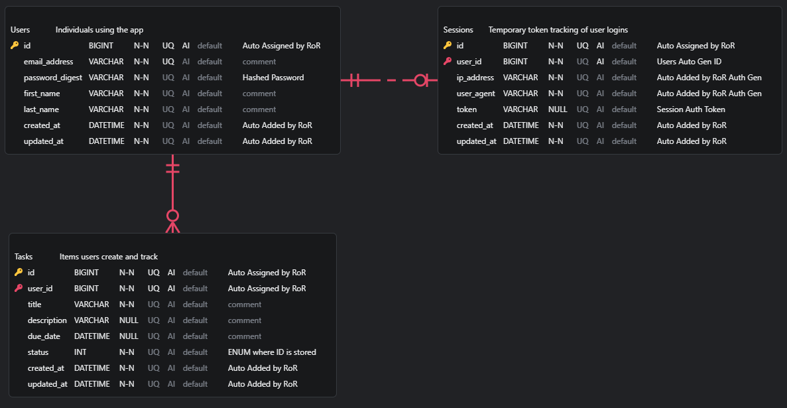
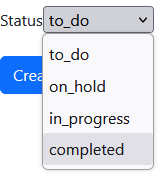

# Minimal Task Manager App
Submission for the Mocingbird assignment to make a minimal task manager application.

Submitter: Lucia Rosado-Fournier

---

### Planning

A lot of initial research on:
- Best version to use
- Best way to perform authentication given the time frame
- How to connect Backend to Frontend
- Data modeling in Ruby specifically

#### RoR + Angular Communication

Based on the research done, the most common way of connecting a Ruby on Rails back end to an Angular front end is to utilize the Rails framework's API only mode. This lightweight option allowed me to get the skeleton of the project back end, including data models, together relatively quickly. 

There was a small hurdle getting the CORS enabled correctly, but with this configuration I was able to get a basic app together within a few hours.

#### Authentication

Aside from being the latest release, a big reason I chose RoR 8 was for it's built in authentication generator. Exploring through it also ended up influencing my final data model choices. However, the backend needing to be API only and the time limit lead me to tweaking the methodology of the authentication to use a temporary bearer token approach. Using the skeleton generated by the framework, that was also completed relatively easily.

#### Data Modeling

☺ Yay (Making code diagrams is the second best part of programming)

For simplicities sake, the database consists of three tables as seen in the diagram below:
- Users
- Sessions
- Tasks


Of course, the user is the entity interfacing with the application, and as a user, they're allowed to have many tasks in their account. Utilizing the authentication framework, the users table is also able to securely store the users password. I like to think of the users as the main entity that drives the rest of the data model.

The sessions table was made by default with the authentication generator, but I liked the idea of keeping track of the users session with a token for a simple authentication. This also helped strip away some of the complexities that come with a cookies based approach. At any given time, a user will have one active session they can utilize to interface with the application.

The star of the project, the humble task, was made as per requirements. For the status of the task, I ultimately went with an ENUM. I found the Ruby enums really flexible to use and serves as an easy way to modify the list without having to make modifications to mulple places in the app. The labels are indexed starting from 0 and those indexes are what's stored into the table. From there, the create and edit drop down menus in Angular call the ENUM to get the latest labels. Let's say, for example, the wording of "In Progress" was too long and we wanted to change it to "WIP", that change can be made in the ENUM decleration and be reflected everywhere instantly because the presentation and data layers are getting the value based on the index. 

---
### Project Set Up

This was developed in Linux (I started with Ubuntu WSL but had to migrate to my laptop with Fedora). Please find the steps to replicate on a Linux enfironment below.

#### Pre-Requisite

Ensure the following dependencies are installed:

**Main Stack:**

- Ruby 3.4.7 
- Rails 8.1.1
- Angular 21.0.6 Node 24.12.0 NPM 11.6.2
- Postgres 16 - with basic postgres user created

**Linux packages used:**
- (Debian Version) build-essential libssl-dev libyaml-dev zlib1g-dev libgmp-dev
- (Fedora Version) libyaml-devel openssl-devel zlib-ng-compat gmp-devel 
    - (DNF4) "C Development Tools and Libraries" "Development Libraries" "Development Tools" 
    - (DNF5) development-tools c-development development-libs 
- git ruby-devel zlib-devel postgresql-server postgresql-contrib rustc

#### Steps
1. Clone Repo into desired directory

2. Frontend configuration
```bash
cd min_task_man_app/mtma_fe/
npm install
```
3. Backend configuration
```bash
cd ../mtma_be/
bundle install
```
4. Database configuration

a. Start DB if not already
```bash
sudo systemctl start postgresql.service
```

b. Access psql through default postgres user
```bash
sudo -u postgres psql
```
c. Create DB user for the application. Be sure to replace `<INSERT_PASS_HERE>` with your own password
```bash
CREATE USER mtma WITH PASSWORD '<INSERT_PASS_HERE>';
ALTER USER mtma WITH SUPERUSER;
\q
```

d. Add the password as an environment variable
```bash
echo "export MTMA_DATABASE_PASSWORD=<INSERT_PASS_HERE>" >> ~/.bashrc
source ~/.bashrc
```

e. Since this is running locally, needed to change the authentication type to md5. This can be done by editing `/var/lib/pgsql/data/pg_hba.conf`

Find lines:
```bash
local   all             all                                     ident/peer
host    all             all             127.0.0.1/32            ident/peer
```

And change to:
```bash
local   all             all                                     md5
host    all             all             127.0.0.1/32            md5
```

f. Restart DB so changes apply
```bash
sudo systemctl restart postgresql.service
```

g. Create DB and tables (Assuming you're still in the mtma_be directory)
```bash
rails db:create
rails db:migrate
```

5. Start application

In terminal 1
```bash
cd min_task_man_app/mtma_be/
rails s
```

In terminal 2
```bash
cd min_task_man_app/mtma_fe/
ng serve -o
```

If the browser does not start automatically, navigate to http://localhost:4200/ in your browser.

---
### Demo

I recorded a demo and made it into a GIF below:


The ENUM drop down:



---
### Resources

I mainly referred to the Rails and Angular official documentation and a handful of Medium articles that went over details on using Angular with an API backend. Most of the implementation was putting together different boiler plate programs to meet the requirements.

Thank you for the opprotunity, I learned a lot and really enjoyed the process! I'll probably come back to it to solve some shortcomings with it. 